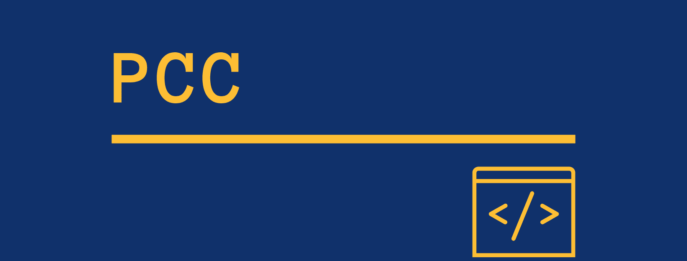

# PCC
##### Perfect Clone Challenge is a way to get new skills and a portfolio project.
---

### What is PCC?

Once upon a time, in my second IT work, I was given an introductory task to understand React and Redux technologies (before that at the first work I went through some hell with CMS type WordPress, Joomla and Bitrix, and the front was ... It was unlikely that this could be called a front-end, rather pieces of a JS code inside PHP. In general, when I was tired of it, I began to look for a company for my growth).
And my first major training project was the creation of a Trello clone (of course, to a banal simplified one, but nevertheless, this made it possible to very quickly understand how React works and how Redux controls the application state).
The years have passed since then, but recently I remembered this experience and thought that this was a great idea to work out skills in a certain language/framework. So the idea of ​​PCC appeared.
The essence of the challenge is that we take some existing technology or service, analyze its device and architecture, lay out on the "bricks", and after that we begin independent work on creating a similar project.

### Rules of PCC

- The project clone is created not for commercial use, but for educational and developmental purposes. However, you can use it as part of your portfolio under a license, convenient for you.
- When working on the analysis of the source service, you do not look for the source code of the project and do not copy blindly API or any other code. The essence of Challenga in an attempt to develop in you project, architectural and creative thinking.
- You can make both a project on one technology and several clones on different technologies. The more technologies you use, the cooler you will become;)
- For convenience, for each PCC challenge, Trello Board will be created, which you can encourage yourself to completely simulate the real “combat” work on the project where you have tasks, their statuses and division into work blocks.
- Each challenge should be independent of the technologies on which it can be implemented. If you want to add a new challeng for PCC, keep in mind this rule when compiling a challenge for a challenge. We can make the same Trello both on React and Vue.js, Angular, Svelte or Pure JS. Backend can be made on Node.js, and on Java, Python or any other stack. The tasks should not be attached to the technology, but only imitate the requirements of the "business" to the desired product.

